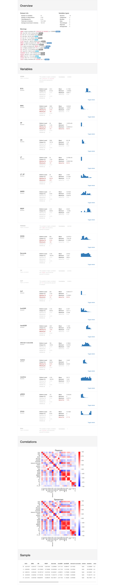

# Stress classifier with AutoML

This repository presents an automated machine learning approach in Python to create a stress monitoring system with data from devices such as fitness trackers. With the rising popularity of trackers that monitors biological signals 24/7, there is just a matter of time before the technology matures and everyone will be wearing their own ‘doctor AI’ on the wrist, this project is one step in that direction.

Note: This code is a simplified version of my master's dissertation done during the summer of 2017. For more information about data handling, and other machine learning approaches, please see the full masters dissertation available [here](https://1drv.ms/b/s!ApqYcVCNnKvChu1nfGu5bMnh8jckkw).

[Code tutorial and data description can be found at my blog dataespresso.com](http://dataespresso.com/).

